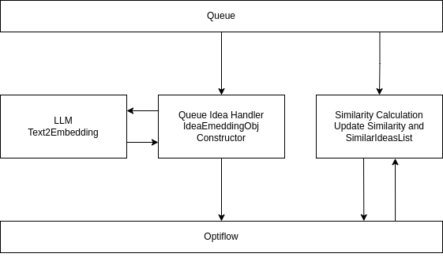

# Вычисление степени похожести инноваций (идей)
## Обоснование потребности 

Для существующего бизнес-процесса "Идеи" требуется реализовать доработку следующего характера:

ввиду большого количества новых генерируемых пользователями идей возникает потребность в отслеживании похожих по смыслу идей в целях экономии времени как самих пользоватаелей, так и экспертов, а также ресурсов компании.

## Предлагаемое решение

  

Решать задачу нахождения похожих по смыслу идей предлагается с помощью нейросетевых алгоритмов.

Карточка идеи содержит следующие **текстовые** поля, несущие в себе значимую информацию:

- ***Наименование*** — содержит название идеи;
- ***Текущее состояние*** — содержит описание текущей ситуации, которую предлагается улучшить;
- ***Предлагаемое решение (будущее состояние)*** — содержит предоложения по улучшению процессов на предприятии.

Предлагаемое решение содержит в себе систему из модулей:

- **Нейросетевой модуль с языковой моделью *LLM***. Реализация — Python. Осуществляет извлечение полезной информации из текстовых параметров идеи, формирует эмбеддинги (векторизированное представление текстов идеи).
- **Модуль векторизации идей из очереди *Queue Idea Handler***. Реализация — Node.js. При появлении необработанной идеи в глобальной очереди осуществляет POST-запросы к модулю LLM, в ответ получает эмбеддинг на каждое текстовое поле идеи. Формирует объект, соответствующий представлению идеи через эмбеддинги и вставляет в идею ссылку на этот объет.
- **Модуль расчёта схожести моделей *Similarity Calculation***. Реализация — Node.js. Принимает на вход объект с эмбеддингами, проходится по всем имеющимся в системе идеям, рассчитывает косинусное сходство и формирует объект, содержащий список наиболее похожих идей и отметку о текущем состоянии объекта. 

При редактировании текстовых полей идеи ***Queue Idea Handler*** отлавливает изменения, пересчитывает соответствующий эмбеддинг в ***LLM***. Далее ***Similarity Calculation*** пересчитывает схожесть рассматриваемой идеи с остальными.

Полученные результаты о сходстве идей могут направляться экспертам, администраторам идей и авторам.
